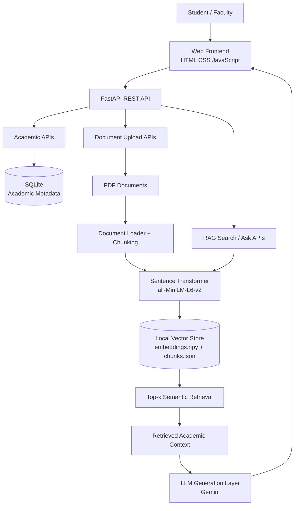

# 🎓 University AI Assistant

> An AI-powered academic assistant that combines a FastAPI backend, document ingestion, semantic embeddings, local vector retrieval, and an LLM generation layer to answer university-related questions from institution-provided material.

   

## 📌 Project Overview

University AI Assistant is a university-focused question-answering platform designed around academic documents. Students can interact with a web portal, while faculty/instructors can manage academic material and upload documents for processing.

The backend exposes REST endpoints through FastAPI. Academic data is maintained in SQLite, while the RAG layer converts document chunks into embeddings and stores the resulting vectors locally for semantic retrieval. The repository also contains generated document chunks and an embedding matrix used by the current local retrieval implementation.

The project is structured as an MVP that can be extended into a production academic AI platform with authentication, cloud storage, a managed vector database, stronger evaluation, and deployment infrastructure.

---

## ✨ Key Features

### Student
- Academic context selection
- Natural-language question answering
- Chat-style interaction
- Follow-up questions
- Source-aware responses from academic documents

### Faculty / Instructor
- Faculty portal UI
- Subject-oriented document management
- PDF upload workflow
- Academic document organization
- Document processing and indexing

### AI / RAG
- PDF/document ingestion
- Text extraction and chunking
- Sentence-transformer embeddings
- Semantic similarity search
- Top-k relevant chunk retrieval
- Source metadata retained with retrieved chunks
- LLM generation using retrieved context

### Backend
- FastAPI REST API
- CORS configuration
- Academic metadata APIs
- Document upload APIs
- RAG search and question-answering endpoints
- Health-check endpoint
- Modular API, database, model, service and RAG packages

---

## 🏗️ System Architecture



For a standalone diagram, see [`docs/architecture.svg`](docs/architecture.svg).

### Architecture layers

| Layer | Responsibility |
|---|---|
| Frontend | Student/faculty portal and chat/document-management UI |
| API | FastAPI REST endpoints and request handling |
| Database | SQLite academic/application data |
| Ingestion | PDF loading, text extraction and chunking |
| Embeddings | Sentence Transformers with `all-MiniLM-L6-v2` |
| Retrieval | Vector similarity search using NumPy |
| Generation | LLM response generation using retrieved context |

---

## 🔄 RAG Pipeline

```text
Academic PDF
    ↓
Document Loader
    ↓
Text Extraction
    ↓
Chunking
    ↓
SentenceTransformer Embeddings
    ↓
Normalize Embeddings
    ↓
Save embeddings.npy + chunks.json
    ↓
-----------------------------
Student Question
    ↓
Question Embedding
    ↓
Dot-Product Similarity
    ↓
Rank Chunks
    ↓
Top-K Relevant Chunks
    ↓
Retrieved Academic Context
    ↓
LLM Generation Layer
    ↓
Grounded Answer
```

The implementation uses normalized `all-MiniLM-L6-v2` embeddings. Document vectors are saved in `embeddings.npy`, while chunk text and source metadata are saved in `chunks.json`. Query vectors are compared with the stored vectors and the highest-scoring chunks are returned.

---

## 🧠 Embeddings & Vector Store

### Embedding model

**`sentence-transformers/all-MiniLM-L6-v2`** converts document chunks and user questions into numerical vectors. The vectors are normalized so dot-product similarity can be used for ranking.

### Vector database / retrieval implementation

**Important:** the current MVP does **not** use ChromaDB.

The implemented local vector store uses:

- `embeddings.npy` — NumPy matrix containing document embeddings
- `chunks.json` — JSON containing chunk text and source metadata
- NumPy dot-product similarity for ranking

The vector-store module loads these files, embeds an incoming query, calculates similarity scores, sorts the results, and returns the top-k chunks with source information.

This lightweight design is useful for local development and demonstration. A production version can migrate the retrieval layer to ChromaDB, Qdrant, Pinecone, Weaviate or pgvector.

---

## 🤖 LLM / Gemini API Layer

The architecture uses **Google Gemini** as the generation layer after retrieval. The RAG principle is:

```text
Question → Retrieval → Relevant Academic Context → Prompt → Gemini → Answer
```

The repository contains **no API key**. Credentials must be supplied through environment variables during local execution and must never be committed to GitHub.

---

## 🔌 API Layer

The backend is implemented with FastAPI. It registers academic and document routers and exposes root/health endpoints.

Typical API areas include:

```text
GET  /
GET  /health

/academic/programs
/academic/years
/academic/semesters
/academic/branches
/academic/subjects
/academic/documents
/academic/rag/search
/academic/rag/ask

POST /documents/upload
```

Interactive API documentation:

```text
http://localhost:8000/docs
```

---

## 🛠️ Technology Stack

| Category | Technology | Purpose |
|---|---|---|
| Language | Python | Backend and AI/RAG implementation |
| API framework | FastAPI | REST API and backend services |
| Server | Uvicorn | ASGI development server |
| Database | SQLite | Academic/application metadata |
| Embeddings | Sentence Transformers | Semantic text embeddings |
| Embedding model | all-MiniLM-L6-v2 | Text-to-vector conversion |
| Vector retrieval | NumPy | Local vector storage and ranking |
| Document format | PDF | Academic knowledge source |
| Metadata store | JSON | Chunk and source metadata |
| Frontend | HTML5, CSS3, JavaScript | Student/faculty web interface |
| AI architecture | RAG | Grounded question answering |
| LLM | Google Gemini | Natural-language generation |
| Version control | Git + GitHub | Source control and portfolio hosting |

---

## 📁 Project Structure

```text
University-AI-Assistant/
│
├── backend/
│   ├── app/
│   │   ├── api/              # REST API routers
│   │   ├── database/         # Database layer
│   │   ├── models/           # Data models
│   │   ├── rag/              # Loader, embeddings, vector retrieval
│   │   ├── services/         # Application services
│   │   └── main.py           # FastAPI application
│   ├── documents/            # Backend document workspace
│   └── university.db         # Local SQLite database
│
├── documents/                # Academic/reference PDFs
├── frontend/
│   └── index.html            # Student/faculty web interface
├── tests/                    # Test workspace
├── docs/
│   └── architecture.svg     # Architecture diagram
├── .env.example              # Safe environment template
├── .gitignore                # Secret/cache exclusions
└── README.md
```

---

## ⚙️ Setup & Installation

### Prerequisites

- Python 3.10+
- Git
- A modern web browser

### 1. Clone

```bash
git clone https://github.com/shashank01-aiml/University-AI-Assistant.git
cd University-AI-Assistant
```

### 2. Create a virtual environment

**Windows PowerShell**

```powershell
python -m venv venv
.\venv\Scripts\Activate.ps1
```

**Windows CMD**

```cmd
python -m venv venv
venv\Scripts\activate
```

**macOS / Linux**

```bash
python3 -m venv venv
source venv/bin/activate
```

### 3. Install backend dependencies

```bash
cd backend
pip install -r requirements.txt
```

### 4. Configure environment variables

Copy the template to a local environment file and add your own credentials:

```text
backend/.env
```

Example:

```env
GEMINI_API_KEY=your_api_key_here
```

**Never commit the real key.**

### 5. Start FastAPI

From `backend/`:

```bash
uvicorn app.main:app --reload --host 127.0.0.1 --port 8000
```

Open:

```text
http://127.0.0.1:8000
http://127.0.0.1:8000/docs
```

### 6. Open the frontend

The current frontend is a standalone HTML application:

```text
frontend/index.html
```

Open it in a browser while the FastAPI server is running. Ensure the frontend API base URL points to the local backend.

---

## 🖥️ UI Screenshots

The frontend includes:

- Student login/portal flow
- Student chat interface
- Academic selection controls
- Faculty dashboard
- Subject cards
- Document upload interface
- Chat message area and question input

### Recommended portfolio screenshots

Add real screenshots from the running application under `screenshots/`:

```text
screenshots/
├── student-login.png
├── student-chat.png
├── faculty-dashboard.png
└── document-upload.png
```

**Use screenshots captured from the actual running application**, not generated mockups. This keeps the portfolio accurate and demonstrates that the UI is genuinely implemented.

---

## 🔐 Security

Never commit:

```text
.env
API keys
passwords
private credentials
venv/
__pycache__/
```

Use environment variables for API credentials. The public repository contains no Gemini API key.

For production, add authentication, role-based authorization, restricted CORS origins, HTTPS, rate limiting, secure file validation/storage, secret management and audit logging.

---

## 🧪 Testing & Evaluation

Recommended testing areas:

- API health check
- Academic metadata retrieval
- PDF upload
- PDF parsing
- Chunk generation
- Embedding generation
- Vector retrieval
- Top-k ranking
- RAG question answering
- Source metadata preservation
- Invalid file handling
- Empty questions
- Missing academic context
- Frontend/backend API communication

Run backend tests with:

```bash
pytest
```

---

## 📈 Future Enhancements

### AI / Retrieval

- Production-grade vector database
- Hybrid keyword + semantic retrieval
- Reranking of retrieved chunks
- Structure-aware document chunking
- Page-level citations
- Retrieval evaluation metrics
- Hallucination/faithfulness evaluation

### Application

- Student authentication
- Faculty authentication
- Role-based access control
- Persistent conversation history
- Personalized academic profiles
- Multilingual support
- Voice-based questions
- Notifications and announcements
- Feedback and answer-rating system

### Platform / Deployment

- Docker containerization
- Cloud deployment
- Managed database
- Object storage for PDFs
- CI/CD pipeline
- Observability and logging
- Rate limiting
- Production secrets management
- Background document processing

---

## 🎯 Why This Project Matters

University information is often distributed across PDFs, lecture notes, course material and administrative documents. Conventional search requires students to know exactly what to look for.

This project applies RAG to make academic documents conversationally accessible while keeping generation tied to retrieved material.

### Skills demonstrated

- Generative AI
- Retrieval-Augmented Generation
- Embeddings
- Semantic search
- Vector retrieval
- FastAPI
- REST APIs
- SQLite
- PDF/document processing
- Frontend development
- Git/GitHub

---

## 🚧 Project Status

**Current stage: MVP / internship portfolio development**

The repository contains the core application structure, frontend, FastAPI backend, academic database, document assets and local RAG retrieval implementation. Future engineering work includes productionizing the LLM integration, strengthening evaluation/testing, adding authentication and preparing deployment.

---

## 👨‍💻 Author

**Shashank Adepu**  
GitHub: [@shashank01-aiml](https://github.com/shashank01-aiml)

---

## ⭐ License / Usage

This project is intended for academic, learning and internship portfolio purposes. Add a formal open-source license if the project is later distributed for public reuse.
